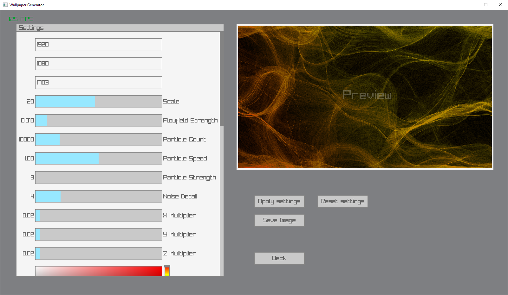
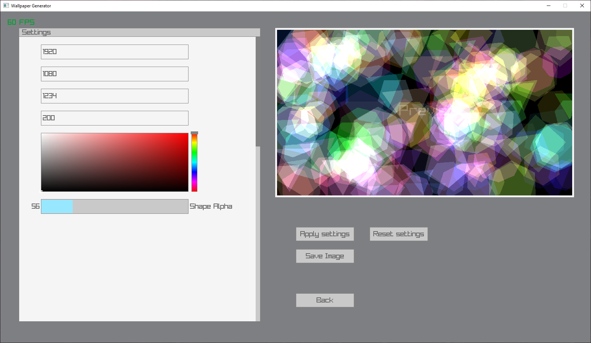
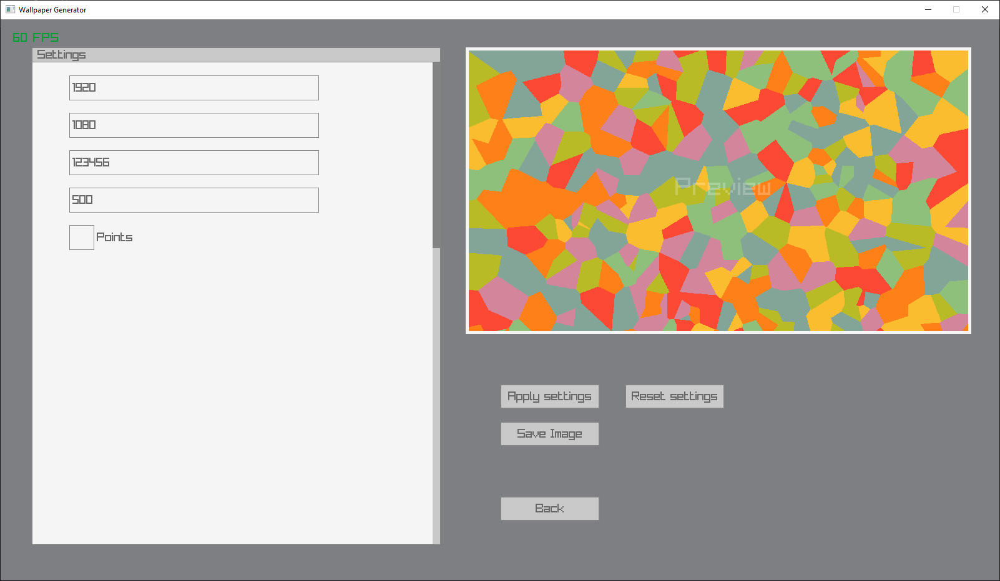
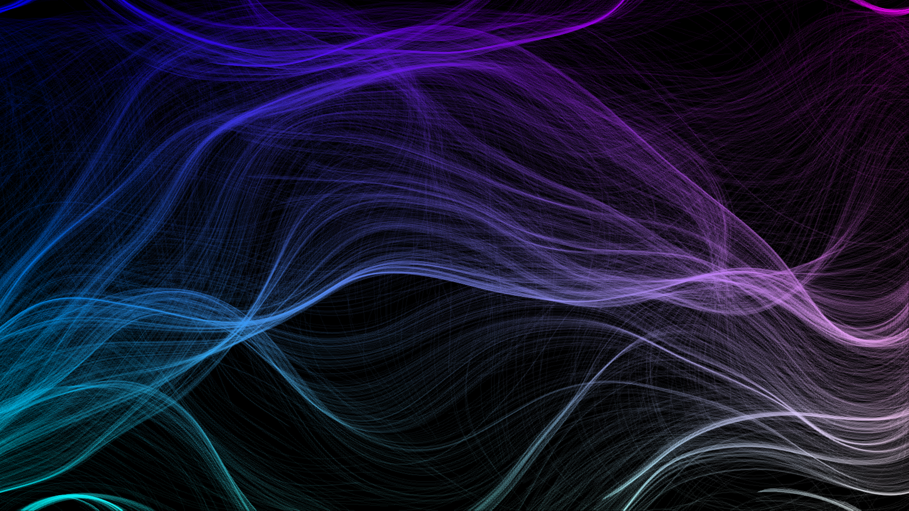
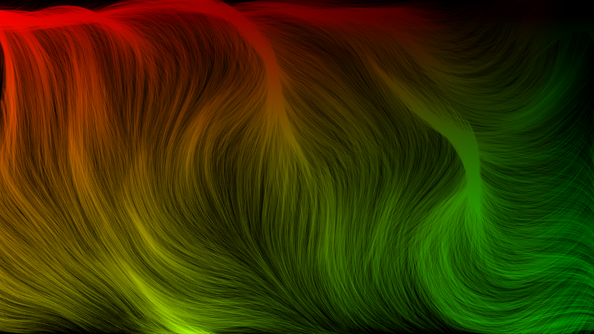
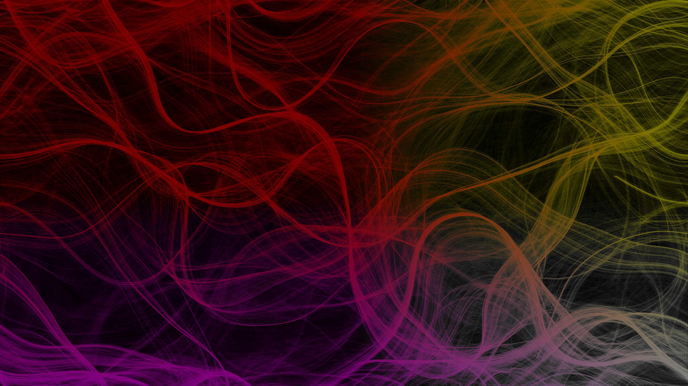
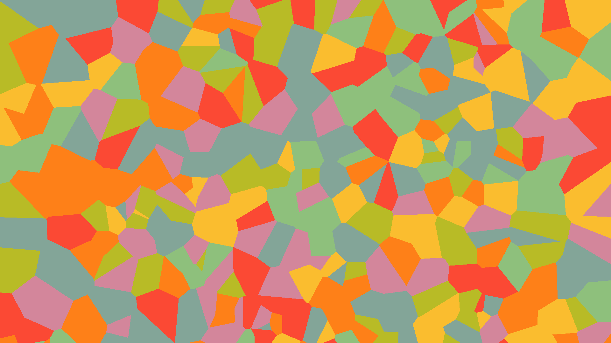

# Wallpaper Generator

## About
A Wallpaper Generator program that lets you design and create procedurally generated wallpaper by specifying various different parameters based off many mathematical principles and functions written in C++ 20.

This project uses uses:
- [Inspiration](https://youtu.be/BjoM9oKOAKY) A video from The Coding Train for creating the flowfield generator.
- [Perlin Noise Library](https://github.com/Reputeless/PerlinNoise)
- [Raylib](https://github.com/raysan5/raylib)

This project is currently being developed as a final qualification project for school.

## Images

## Demo Video (0.4-alpha)
https://user-images.githubusercontent.com/70687973/207644386-f34a8592-bc57-4f4b-8e56-6ef5528a781e.mp4
